  

  
  
  
  

---

## About

I build software that has to survive contact with reality — technicians who need a PDF before the client leaves, reports that look professional, tools people actually open twice.

Based in **Luanda, Angola**. Backend-leaning full-stack. Prefer clear products over clever demos.

### Focus

- **SaaS & web apps** with Python / Flask
- **Pragmatic frontends** — HTML, CSS, JavaScript when a SPA would only slow delivery
- **Operational workflows** — diagnostics, reporting, downloads, browser tools

### Public work

| Project | What it is |
|---------|------------|
| [**pc-health-check**](https://github.com/Claudio-Candido/pc-health-check) | SaaS for IT technicians — diagnostics, health score 0–100, branded PDF reports |
| [**mahjong**](https://github.com/Claudio-Candido/mahjong) | Mahjong Solitaire in the browser — three layouts, no build step |
| [**YoutubePlaylistDownloader**](https://github.com/Claudio-Candido/YoutubePlaylistDownloader) | Flask + yt-dlp — videos, playlists, audio, subtitles (PT UI) |
| [**AppleMusic-Downloader**](https://github.com/Claudio-Candido/AppleMusic-Downloader) | Flask rewrite of an Apple Music downloader — PT interface |

### Stack

`Python` · `Flask` · `SQLAlchemy` · `JavaScript` · `HTML/CSS` · `SQLite` · `ReportLab`

### Right now

Improving public SaaS/docs quality and shipping focused tools. Open to **remote freelance**, collaborations, and engineering roles with real ownership.

---

## Connect

  

| | |
|---|---|
| **LinkedIn** | [claudiojosesecaicandido](https://www.linkedin.com/in/claudiojosesecaicandido/) |
| **GitHub** | [Claudio-Candido](https://github.com/Claudio-Candido) |
| **Location** | Luanda, Angola |

Hiring or building something operational? Reach out on **LinkedIn**.
